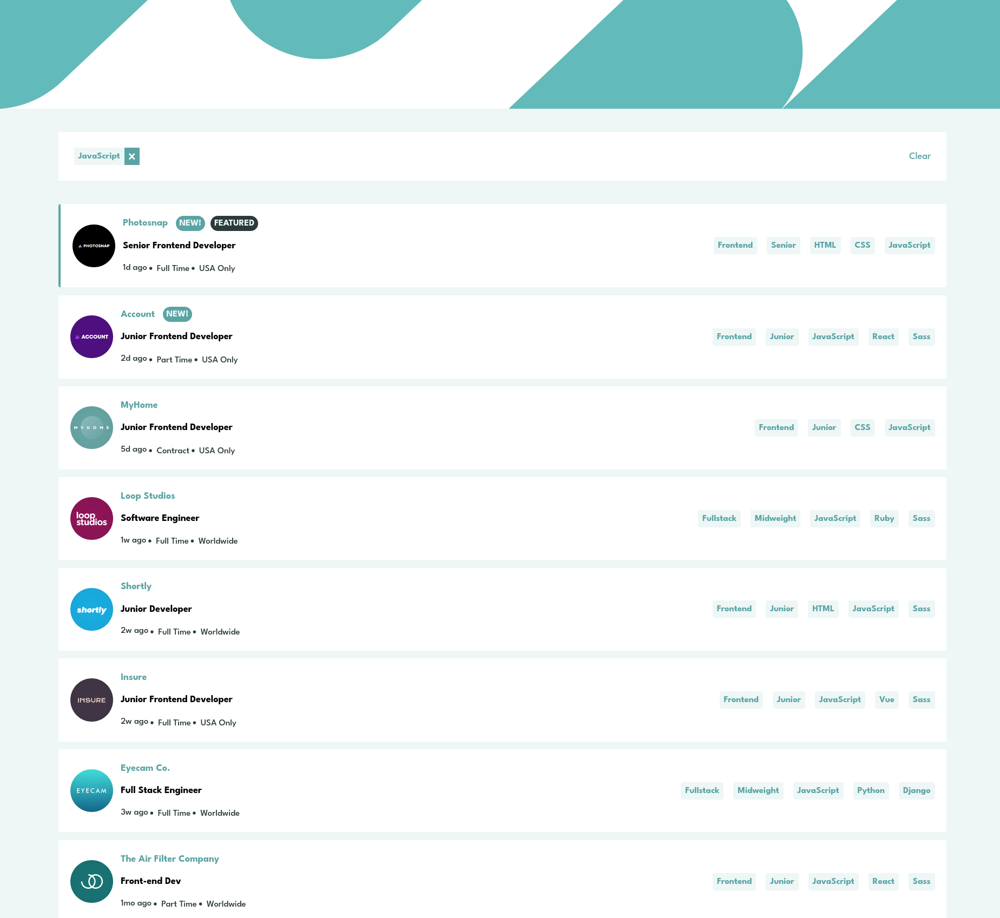
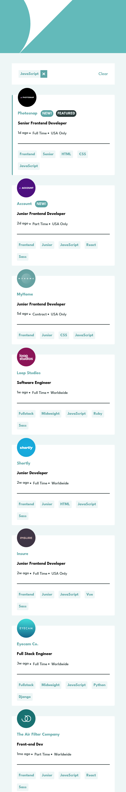

# Frontend Mentor - Job listings with filtering solution

This is a solution to the [Job listings with filtering challenge on Frontend Mentor](https://www.frontendmentor.io/challenges/job-listings-with-filtering-ivstIPCt). Frontend Mentor challenges help you improve your coding skills by building realistic projects. 

## Table of contents

- [Overview](#overview)
  - [The challenge](#the-challenge)
  - [Screenshot](#screenshot)
  - [Links](#links)
- [My process](#my-process)
  - [Built with](#built-with)
  - [What I learned](#what-i-learned)
- [Author](#author)

**Note: Delete this note and update the table of contents based on what sections you keep.**

## Overview

### The challenge

Users should be able to:

- View the optimal layout for the site depending on their device's screen size
- See hover states for all interactive elements on the page
- Filter job listings based on the categories

### Screenshot





### Links

- Solution URL: (https://github.com/DrZero1234/FEM_job_filter)
- Live Site URL: (https://drzero1234.github.io/FEM_job_filter/)

## My process

### Built with

- Semantic HTML5 markup
- CSS custom properties
- Flexbox
- CSS Grid
- Mobile-first workflow
- [React](https://reactjs.org/) - JS library
- [Next.js](https://nextjs.org/) - React framework
- [Styled Components](https://styled-components.com/) - For styles

**Note: These are just examples. Delete this note and replace the list above with your own choices**

### What I learned


```Styled component
  const CompanyImage = styled.div`
    <!-- CSS properties -->
`

<!-- Rendering the image with absolute path without importing -->
return(<CompanyImage as="img" src={logo} />)
```


## Author

- GitHub - [Add your name here](https://github.com/DrZero1234)
- Frontend Mentor - [@DrZero1234](https://www.frontendmentor.io/profile/DrZero1234)


